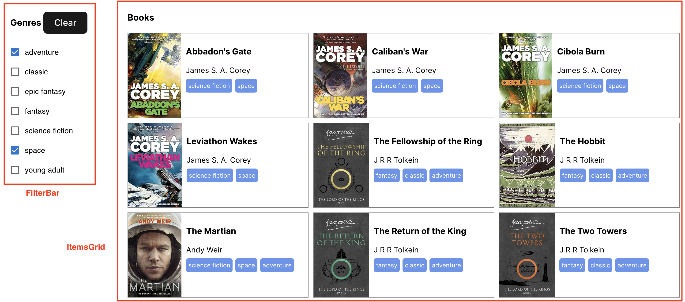

# Welcome to the Search Component (4 Ways) challenge

## Level = `Beginner`

Have you ever seen on Masterchef the way that they cook the same ingredient in 4 different ways in the same dish? Here is an example of rhubarb 4 ways:\
\
(I'm not sure what the 4 ways are, I'm more at the customer/eating end of this world!)

So we're going to do the same thing with a little Search component:\


The way the component works is that the user is able to type into the text input without triggering a search. A search is only triggered when the:

- user clicks the _Search_ button
- user clicks the "Enter" key

This is a pattern known as a composite component. Where we combine two smaller components (`input`, `button`) into a higher level abstraction to facilitate reuse.

But we're going to implement it a bunch of different ways. And we're going to divide the implementations into 2 broad categories of potential implementation:


For more info on this, see here:\
https://stackoverflow.com/questions/42522515/difference-between-controlled-component-and-uncontrolled-component-in-react

I would like you to build the 4 implementations starting with probably the least desirable case.

1. Build an **uncontrolled** Search Box with NO React hooks (`/src/components/SearchBoxNoHooks.tsx`) (tip, you'll need to use `document.getElementById`). How did you find this process? Why do you think this isn't a recommended approach?

2. Build an **uncontrolled** Search Box by accessing the `<input>` using `useRef` (`/src/components/SearchBoxUseRef.tsx`). Why do you think this might be better than approach 1?

3. Build an **uncontrolled** Search Box by using the `useState` hook (`/src/components/SearchBoxUncontrolled.tsx`) (hint: You keep the state up to date using `useState` and the `onChange` callback on the `input`). How does this compare with 2? Do you prefer it?

Okay, time to take a quick break and look back at what we've done. Now it's time to imagine that we have a new requirement:

> I want a `clear` button outside of the Search Box component where I can clear the text inside the Search Box component. Now I'm looking at my uncontrolled Search Box and I'm not really sure how I'm going to implement this clear button? How do I clear this box? Beyond the `initialSearch`, I can't change the value inside the text input!?

4. Build a **controlled** Search Box (`/src/components/SearchBoxControlled.tsx`) which implements the following type:

```
export type SearchBoxControlledProps = {
  search: string;
  setSearch: (value: string) => void;
  commitSearch: () => void;
};
```

Now the value of the Search Box is stored on the outside of the component. Now we see an extra prop callback called `commitSearch`, can you work out why that is there?

This is how it should work, if I search for my name I will pass in search as `""` and every time the user types it will call `setSearch` with the updated value. It is up to me to store that value (outside of the component) and pass that updated value through the `search` prop. It is only when the user hits the `Enter` key or clicks the button that the `commitSearch` callback is fired.

What this means is that if I want to clear the Search Box from _outside_ of the component then I actually just need to set the search to `""`, and I can easily support this new use case.

5. BONUS - There is a way to build an **uncontrolled** Search Box that can have its value cleared. This will involve utilizing:
   `forwardRef` and `useImperativeHandle`. This is non compulsory, but maybe you want to do it to challenge yourself and prove to me what a programmming BOSS you are!\
   

## How to do this workshop

Complete each exercise one at a time and submit to Duncan for a little chat. Good luck!
