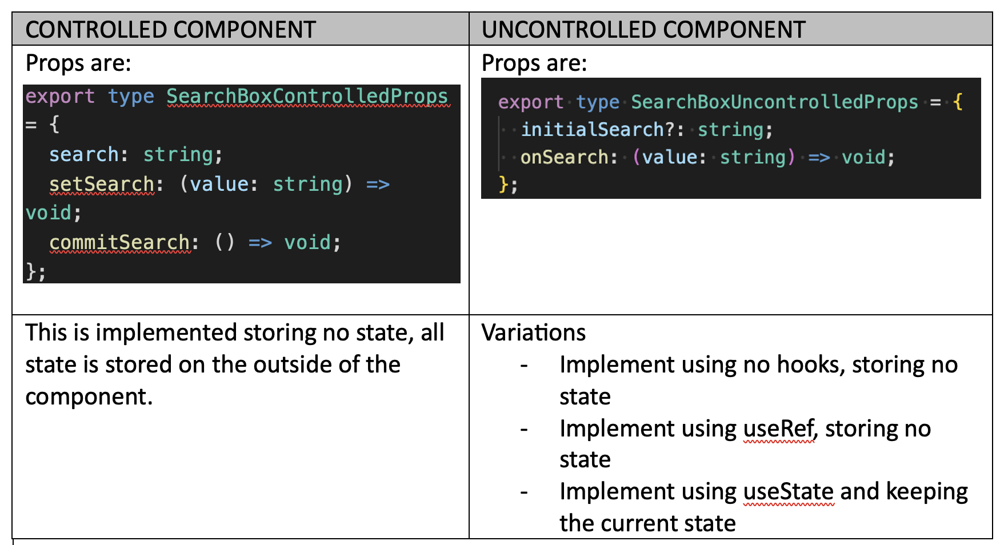

# Welcome to the Filter/No Filter Challenge

## Part 1 - Level = `Beginner/Intermediate`

### What will I learn if I complete this challenge?

- React Fundamentals
  - Component abstraction, learn to separate into components properly
  - Utilize `useEffect`, `useState` properly with types
  - Other core react concepts like keys, callbacks and interaction with lower level componet libraries
  - Controlled props vs uncontrolled props pattern
  - Utilizing vite build tool (as opposed to create react app)
- TDD
  - Test components to 100% coverage
  - Learn how to properly mock a non REST API backend
  - Learn to test interaction of various different components

### What am I asking for?

I've built the backend, I'm looking for you to build this:


I want 3 components:

1. `BooksPage` component that holds the components 2 and 3
2. `ItemsGrid` (dumb/stateless) component with this props type:

```
type ItemsGridProps = {
  books: Book[];
};
```

3. `FilterBar` component with this props type:

```
type FilterBarProps = {
  title: string;
  filters: string[];
  onFilterChanged: (filter: string[]) => void;
};
```

Note that `FilterBar` should be implemented with the "uncontrolled props" pattern. This means that the filter bar keeps track of it's own selected filters state but this means that it can't be passed default selections or have its selection settings modified from outside of the component (well it can with great effort by using `forwardRef` and `useImperativeHandle` - https://react.dev/reference/react/useImperativeHandle). For now, lets use uncontrolled and later on we can wok out _how_ to turn it into a controlled and _why_ we would want to do that.

There is an API (which is a fake API - not Axios - designed to simulate a CMS use case where you can't mock using Axios Mock Handler) which provides you with 2 async functions for getting:

- Genres (`getGenres`)
- Books (`getBooks`). This is passed a list of genres (and will return all books if the genre list is empty)
  You will not be required to modify or change this API in any way.

My recommendation is to complete the exercise in this order:

1. Create the `BooksPage` scaffolding
2. Create the `FilterBar` component

(Create a version of this component that console logs on the `onFilterChanged`) event. You would expect your logs to look like this:\
\
INITIAL LOAD:\


```
onFilterChanged {filters: Array(0)}
```

\
CLICK ON CHECK BOX:


```
onFilterChanged {filters: ['classic']}
```

CLICK ON "CLEAR" button:


```
onFilterChanged {filters: Array(0)}
```

`CHECKPOINT #1` - Its time to submit your work to Duncan. Please don't do any more until Duncan has reviewed your work and had a little chat.

3. Test the `FilterBar` component to 100% coverage.

This filter bar component is kind of nice and generic. You can pass anything as a filter and it will handle it. Therefore we expect this to be usable in a lot of places in the website and would like it to be stable/well tested.

> This example stems from a situation I encountered with a marketing website that was mainly a portal for a bunch of articles:
> 
> The filter bar component was poorly written and cut + paste duplicated all across the website. Having a super-reusable, super-stable version of the component resuable across the whole website became really useful, cutting down massively on total cot of ownership:
> 

`CHECKPOINT #2` - Once you have tested the `FilterBar` to the best of your ability please send the results to Duncan and it will almost certainly be time for a little at chat.

4. Now it is time to build the `ItemsGrid` component that will display the books in (you guessed it) a grid. Obviously I would expect that you'd create 2-3 components to do this (I created `ItemsGrid`, `ItemTile`, `ItemTags`). Give the components generic non-book specific names with the idea that they could be used for other things... I recommend not bothering to tests these components, maybe they'll just get covered by the testing we do on the parent page?

5. Not it is time to build the `BooksPage` to wire it all together.

Implementation Tips\

- Load the genres async first using `useEffect`
- When you have genres, render the `FilterBar` component with the genres and use the `onFilterChanged` callback to call `getBooks`.

`CHECKPOINT #3` - Before we start testing it is time to send what you have to Duncan. Which will probably result in another little chat. Maybe coffee. Maybe even a biscuit. Not sure which type of biscuit, TBC.

6. Test `BooksPage` to 100% coverage. The most important thing to be aware of is that the `FilterBar` is already tested, so what you are really testing is that the `getGenres` and `getBooks` are called correctly and the mocked responses from those are displayed correctly.

`CHECKPOINT #4` - Time to send Duncan what you have done. And time for a chat etc etc.

### The End - Or is it?

Okay, we got there. Take a few minutes to relax.

Unfortunately new requirements have arrived from the business. They need to be able to reset the filters from outside of the filters component (for when they have multiple filters). This is a pretty normal pattern for "Shopify-style" filters:


So how do we do this to our filter bar? Well there are 2 ways but there is only one that will survive a code review. If you feel like
some extra credit (100 points for Gryffindor) you can give this way a go:

1. Create a `useRef` inside the `BooksPage` pass it to the `FilterBar` using the `forwardRef` function and use the `useImperativeHandle` hook to implement a `clear` method. Good luck!

2. Anyway, the more "proper" React way to provide `Clear` function from outside out `FilterBar` is to make `FilterBar` a controlled props component, where the state is 100% controlled from outside the component.

This would be the interface for such a pattern:

```
type FilterBarProps = {
  title: string;
  filters: string[];
  selectedFilters: string[];
  setSelectedFilters: (filter: string[]) => void;
};
```

Your job is to create a component called `FilterBar` that has its state controlled from outside of it (with the above props). For the `BooksPage` itself, instead of calling `getBooks` from the `onFilterChanged` method, you should use `useEffect` to make the `getBooks` call _depend_ on the value of `selectedFilters` that you are now storing in the page.

The final thing is to create a "Clear All" button as part of the `BooksPage` that you can use to clear the selected filters. How easy was that?!?

`CHECKPOINT #4` - Send your solution to Duncan, you are almost there! Another demo and a chat and we've crossed the finish line!
